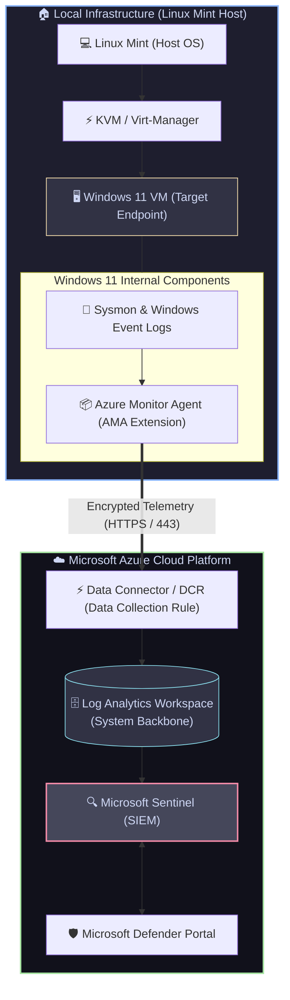

# SOC-lab

```mermaid
flowchart TD
    subgraph LOCAL["🏠 Local Infrastructure (Linux Mint Host)"]
        direction TB
        HOST["💻 Linux Mint (Host OS)"] --> HYPER["⚡ KVM / Virt-Manager"]
        HYPER --> WIN11["🖥️ Windows 11 VM (Target Endpoint)"]
        
        subgraph VM_INSIDE["Windows 11 Internal Components"]
            LOGS["📝 Sysmon & Windows Event Logs"]
            AMA["📦 Azure Monitor Agent (AMA Extension)"]
            LOGS --> AMA
        end
        
        WIN11 --- VM_INSIDE
    end

    subgraph CLOUD["☁️ Microsoft Azure Cloud Platform"]
        direction TB
        DC["⚡ Data Connector / DCR (Data Collection Rule)"]
        LAW[("🗄️ Log Analytics Workspace\n(System Backbone)")]
        DEFENDER["🛡️ Microsoft Defender Portal"]
        SENTINEL["🔍 Microsoft Sentinel (SIEM)"]

        DC --> LAW
        LAW --> SENTINEL
        SENTINEL <---> DEFENDER
    end

    AMA == "Encrypted Telemetry (HTTPS / 443)" ==> DC

    style LOCAL fill:#1e1e2e,stroke:#89b4fa,stroke-width:2px,color:#cdd6f4
    style CLOUD fill:#11111b,stroke:#a6e3a1,stroke-width:2px,color:#cdd6f4
    style WIN11 fill:#313244,stroke:#f9e2af,stroke-width:1px,color:#cdd6f4
    style SENTINEL fill:#45475a,stroke:#f38ba8,stroke-width:2px,color:#cdd6f4
    style LAW fill:#313244,stroke:#89dceb,stroke-width:1px,color:#cdd6f4
```
